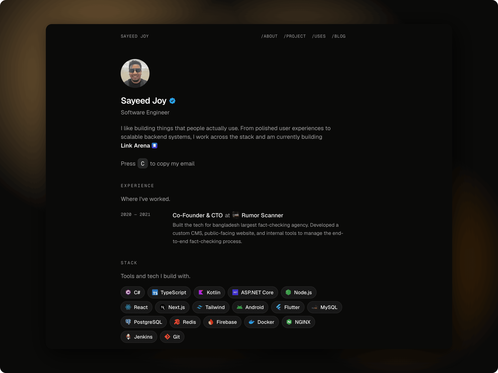

# DevFolio — a developer portfolio template

DevFolio is a clean, minimal portfolio for developers. One narrow centered column, light and dark themes, and a built-in blog. It is fast, easy to read, and simple to make your own — fork it, replace the text, and deploy.

<p align="center">
  
</p>

<p align="center">
  <a href="https://sayeedjoy.com"><b>Live demo</b></a>
  &nbsp;·&nbsp;
  <a href="#getting-started">Getting started</a>
  &nbsp;·&nbsp;
  <a href="#make-it-yours">Make it yours</a>
  &nbsp;·&nbsp;
  <a href="#deploy">Deploy</a>
</p>

## Stack

- **[Next.js 16](https://nextjs.org)** (App Router) + **React 19**
- **[Tailwind CSS v4](https://tailwindcss.com)** + **[shadcn/ui](https://ui.shadcn.com)** (`base-nova` style, lucide icons)
- **[next-themes](https://github.com/pacocoursey/next-themes)** for light and dark mode
- **MDX** blog via `next-mdx-remote`, `rehype-pretty-code`, `remark-gfm`, with Mermaid diagram support
- TypeScript throughout, Prettier + ESLint (`eslint-config-next`)
- Deploys on **Vercel**, or any Node host (see [Configuration](#configuration))

## Features

- **Minimal, content-first design** — a single centered column that reads well on any screen.
- **Light and dark themes** out of the box.
- **All content in one place** — your text lives in simple typed files under `data/`, so you edit content instead of digging through components.
- **Built-in blog and project pages** written in MDX (Markdown with components), with code syntax highlighting and Mermaid diagrams.
- **Good SEO by default** — sitemap, `robots.txt`, RSS feed, OpenGraph, and JSON-LD structured data, plus machine-readable extras like `llms.txt`.
- **Security headers** — a Content-Security-Policy and sensible defaults applied to every route.

## Getting started

You need **[pnpm](https://pnpm.io)** and Node `>=20.9` (see `.nvmrc`).

```bash
git clone https://github.com/your-username/devfolio.git
cd devfolio

pnpm install
cp .env.example .env   # set SITE_URL for production builds off Vercel
pnpm dev               # http://localhost:1408
```

Open [http://localhost:1408](http://localhost:1408) to see the site.

### Scripts

| Command          | Description                                  |
| ---------------- | -------------------------------------------- |
| `pnpm dev`       | Start the dev server on `localhost:1408`     |
| `pnpm build`     | Production build                             |
| `pnpm start`     | Run the production server                    |
| `pnpm lint`      | Run ESLint                                   |
| `pnpm typecheck` | Type-check with `tsc --noEmit`               |
| `pnpm format`    | Format files with Prettier                   |

Before committing, run `pnpm typecheck && pnpm build` to make sure everything is healthy.

## Project structure

```
app/            Pages and routes (blog, projects, SEO files)
components/      UI sections and reusable pieces
  ui/            shadcn/ui building blocks
data/            Your content, split one file per section
lib/             Helpers (site URL, content loaders, icons, utils)
public/          Images, icons, and other static assets
content/         Your blog posts and project write-ups (MDX)
```

## Make it yours

Everything visitors see is data, not hardcoded markup. To make it yours:

1. **Edit the content files in `data/`** — each section has its own file:

   | File                 | What it holds                                  |
   | -------------------- | ---------------------------------------------- |
   | `data/profile.ts`    | Name, headline, hero copy                      |
   | `data/work.ts`       | Work history (detailed entries)                |
   | `data/experience.ts` | Work history (compact list)                    |
   | `data/ventures.ts`   | Ventures and side projects                     |
   | `data/stack.ts`      | Tech stack shown on the page                   |
   | `data/education.ts`  | Education history                              |
   | `data/personal.ts`   | Personal / about content                       |
   | `data/uses.ts`       | The `/uses` page                               |
   | `data/contact.ts`    | Contact links and email                        |
   | `data/types.ts`      | TypeScript types for all of the above          |

   `data/content.ts` pulls these together into the single export the app reads.

2. **Write posts and project pages** — drop MDX files into `content/blog` and `content/project`.
3. **Swap the assets in `public/`** — photos, project images, icons, and `feature.png`.

## Configuration

`SITE_URL` sets the address used to build absolute links for metadata, the sitemap, and RSS. On Vercel it is detected automatically. On any other host, set it in `.env` (see `.env.example`). A production build with no resolvable URL fails early instead of publishing `localhost` links.

## Deploy

DevFolio is a standard Next.js app and runs anywhere Node runs.

- **Vercel** — import the repository and deploy. `SITE_URL` is detected automatically.
- **Any Node host** — run `pnpm build` then `pnpm start`, and set `SITE_URL` in the environment.

## Contributing

Issues and pull requests are welcome. Before opening a PR, run `pnpm typecheck && pnpm build`.

## License

Code is released under the [MIT License](./LICENSE).

The **personal content** — bio, photos, project write-ups, branding, and the assets under `public/photos`, `public/projects`, and `content/` — is *not* covered by the MIT license and remains © Sayeed Joy. Fork the structure, not the identity.
