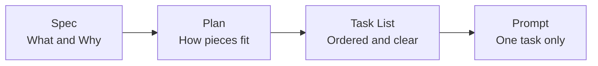
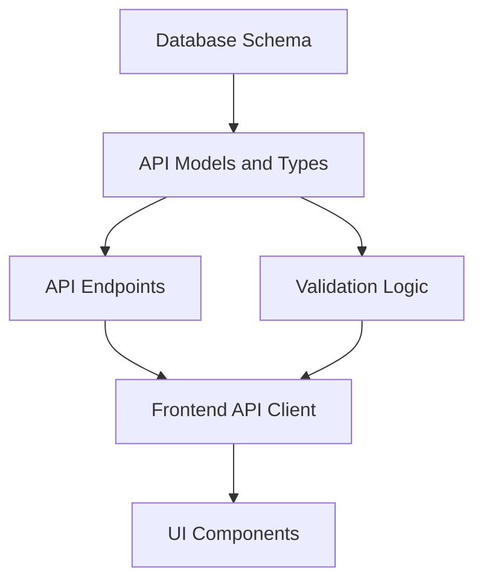
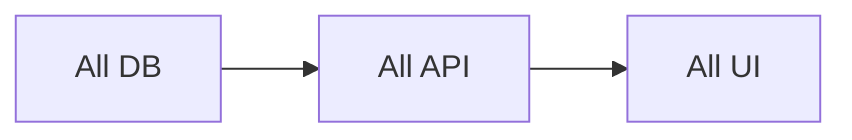
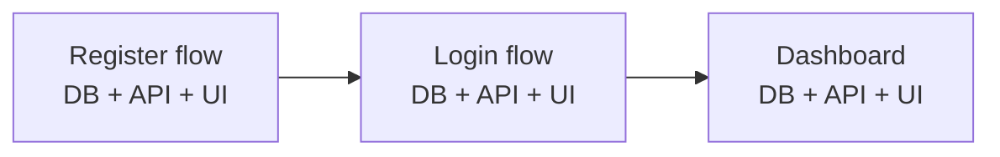
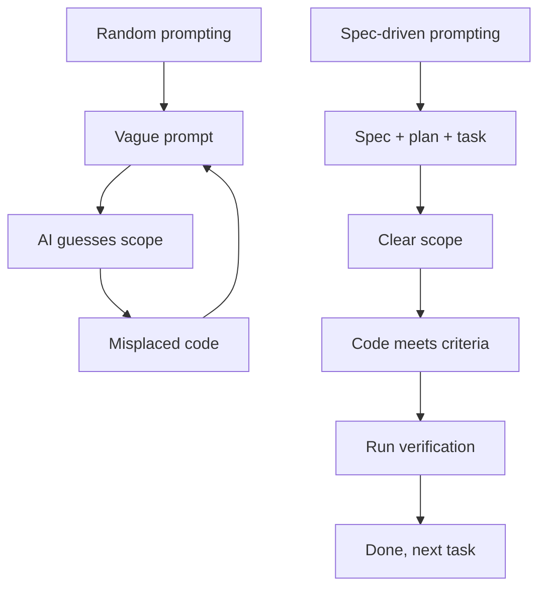
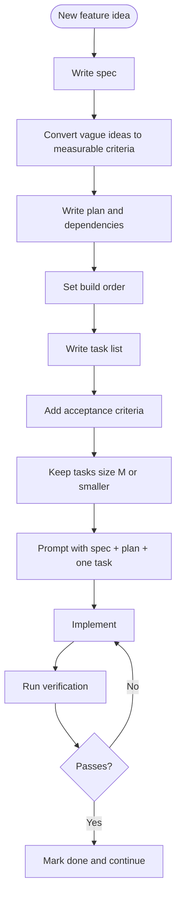

Let's be honest: you open an AI tool, type whatever comes to your head, and start coding.

There is no plan and no clear idea. You are operating on pure vibes.

The AI gives you something, but you don't fully like it. You prompt again and it changes things, but now something else breaks. You prompt again to fix that.

One hour later, you have a mess where code is everywhere, nothing is clean, and you're scared to touch it.

This is random prompting. It is exactly why AI-generated code often feels like a jungle.

The fix is not finding a smarter one-liner prompt. The fix is writing the spec first.

Write the spec, then the plan, and then the task list. Only then prompt the AI with one task at a time and full context.

This is Spec-Driven Development. Nothing fancy, just thinking before typing.

## What the chaos looks like

`"implement the user login feature"`

- `→ okay registration is broken now, fix it`
- `→ actually remove email verification, just use password`
- `→ wait no, add email verification back but make it optional`
- `→ button style is wrong, fix that too`
- `→ also implement the dashboard while you're at it`

Every message changes direction. The AI has no stable architecture context, no decision log, and no constraints.

The result is code that runs but makes no sense. You end up with multiple patterns solving the same thing across different files.

## Three documents before any code

Before writing a single implementation prompt, prepare these three documents:



These are short docs.

- Spec: usually around 30 lines
- Plan: a concise ordered list
- Task list: explicit tasks with acceptance criteria

Together, these replace random back-and-forth prompting.

## Document 1: Spec

The spec answers one question: what are we building, and why?

```md
# Spec: [Feature Name]

## Objective
One paragraph. What is this feature? Who uses it? What does success look like?

## Tech Stack
Framework, language, and libraries with versions.

## Commands
- Build: npm run build
- Test: npm test
- Lint: npm run lint
- Dev: npm run dev

## Project Structure
src/            -> application source
src/components  -> UI components
src/lib         -> shared utilities
tests/          -> unit and integration tests

## Code Style
[paste one real snippet from your codebase]

## Boundaries
- Always: run tests before committing, validate all inputs
- Ask first: DB schema changes, adding new packages
- Never: commit secrets, delete failing tests without approval
```

The `Boundaries` section is critical. It prevents low-quality decisions when you are tired or rushing.

### Turn vague ideas into testable criteria

| Vague requirement | Testable success criteria |
| --- | --- |
| Make the dashboard faster | LCP under 2.5s, data loads under 500ms |
| Improve login UX | Login in under 3 steps, specific error messages |
| Clean up the code | No file over 200 lines, no function over 30 lines |
| Make it more secure | All inputs sanitized, no secrets in source, HTTPS only |

If you cannot verify it, it is not a requirement yet.

## Document 2: Plan

The plan answers one question: in what order should we build?



Build from foundational layers upward. This reduces rewrite churn.

### Slice vertically, not horizontally

Horizontal build style delays working software until very late:



Vertical slices give you working increments:



After the first slice, something real works and can be tested end-to-end.

## Document 3: Task list

The task list answers one question: what exactly am I building right now?

```md
## Task 3: User can register with email and password

What:
Build the registration endpoint and form.
On success, redirect to /dashboard.

Acceptance criteria:
- [ ] POST /auth/register returns 201 on success
- [ ] Duplicate email returns 409 with a clear message
- [ ] Password is hashed before saving
- [ ] Form shows validation errors before submit
- [ ] On success, user goes to /dashboard

Verification:
- [ ] npm test -- --grep "POST /auth/register"
- [ ] npm run build passes
- [ ] Manual: register with new email, check redirect

Depends on: Task 1 (DB schema), Task 2 (User model)
Files: src/routes/auth.ts, src/components/RegisterForm.tsx, tests/auth.test.ts
Size: Medium (3 files)
```

This gives the AI scope, and gives you definition of done.

### Task sizing rule

| Size | Files | Example |
| --- | --- | --- |
| XS | 1 | Add one validation rule |
| S | 1-2 | One new API endpoint |
| M | 3-5 | One full feature slice |
| L | 5-8 | Usually too big, split |
| XL | 8+ | Definitely split |

If a task title includes `and`, it is often two tasks.

## Prompting workflow after docs

Use a scoped prompt, not a vague one:

```txt
Here is the spec:
[paste spec]

Relevant plan context:
[paste dependency section]

Build Task 3 only:
[paste full task]

Do not build anything outside this task.
Stop when all acceptance criteria are met.
```



## Add checkpoints

After every 2-3 tasks, pause and validate:

```md
## Checkpoint: After Tasks 1-3

- [ ] All tests pass: npm test
- [ ] Build passes: npm run build
- [ ] Registration flow works manually end-to-end
- [ ] Review code before moving forward
```

Do not start the next task until the checkpoint passes.

## Full workflow diagram



Random prompting feels fast, but usually creates rework. Spending ten minutes on spec, plan, and tasks saves hours later.